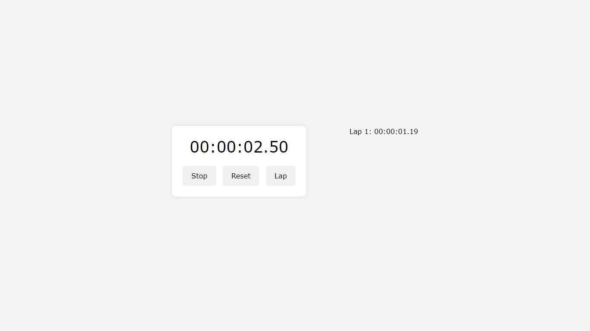
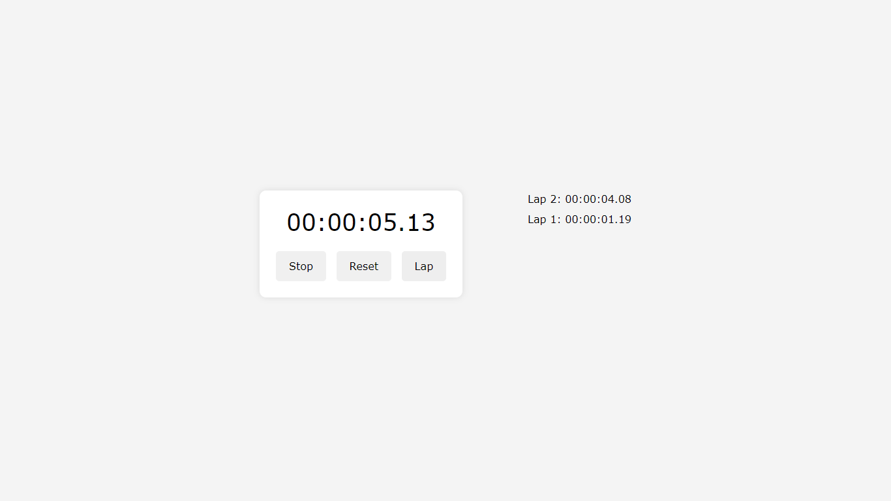
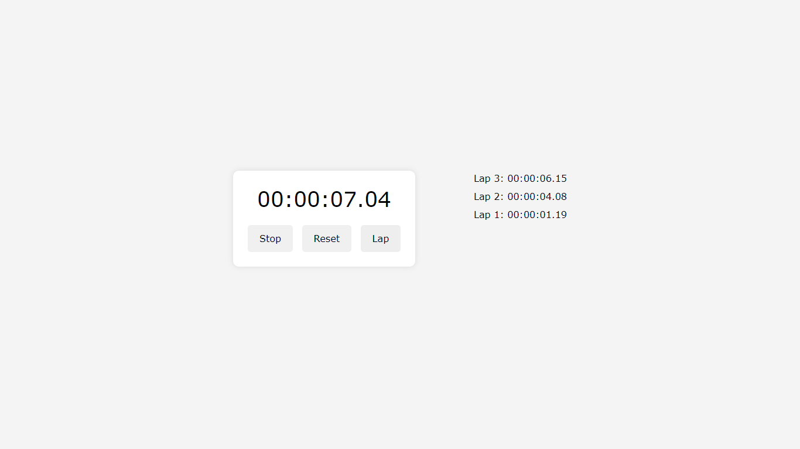
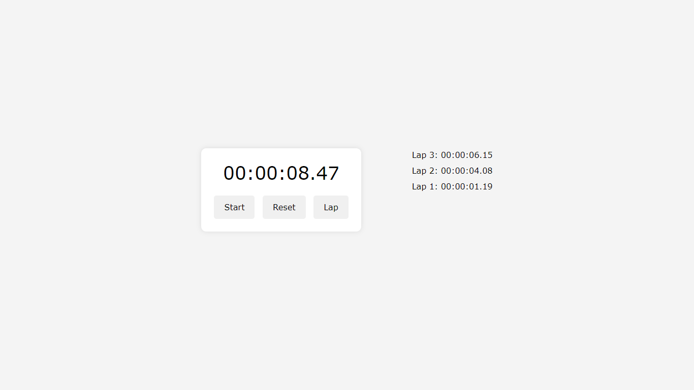
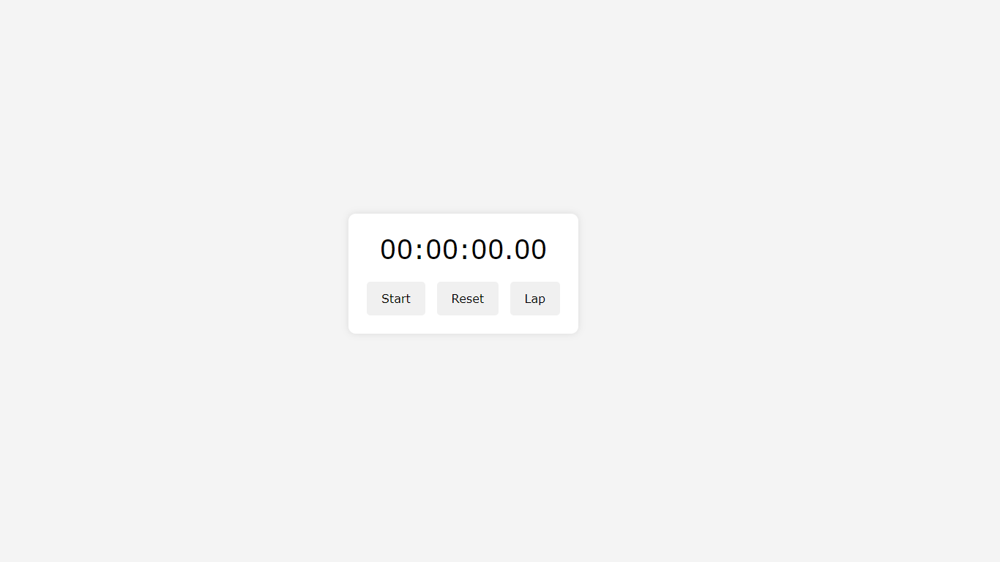

# Stopwatch Web Application

This is a simple web application for a stopwatch built using HTML, CSS, and JavaScript. It allows users to accurately measure and record time intervals, as well as track and display lap times.

## Features

- Start, pause, and reset the stopwatch.
- Record and display lap times.
- User-friendly interface.

## How to Use

1. Clone this repository to your local machine.
2. Open the `index.html` file in your web browser.
3. Click the "Start" button to begin the stopwatch.
4. Click the "Lap" button to record lap times.
5. Click the "Reset" button to reset the stopwatch and clear lap times.

## Files Included

- `index.html`: HTML file containing the structure of the web application.
- `style.css`: CSS file containing styles for the web application.
- `script.js`: JavaScript file containing functionality for the stopwatch.

## Project Images

## Contributing

If you'd like to contribute to this project, feel free to open an issue or submit a pull request.

## Author

Himanshu Maurya